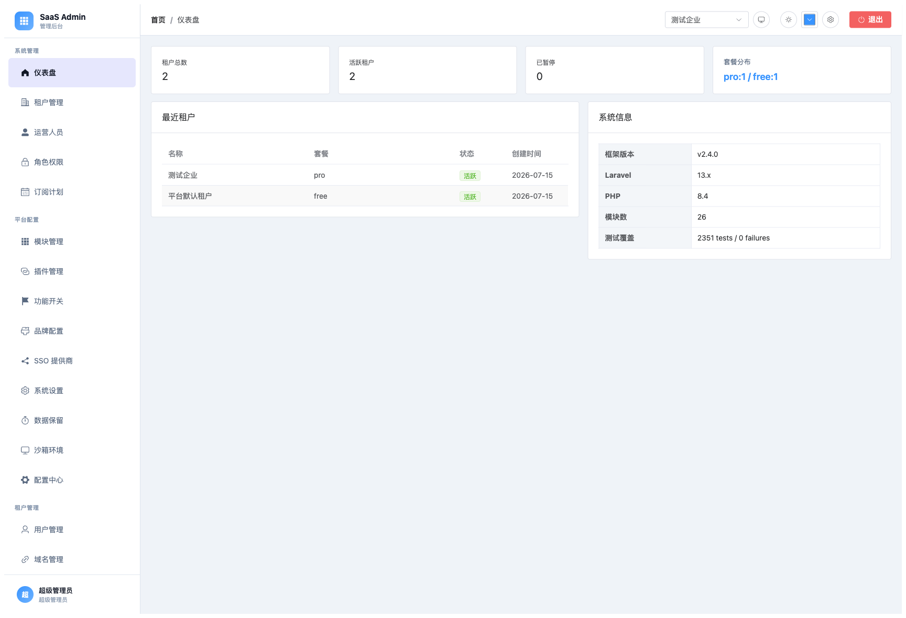
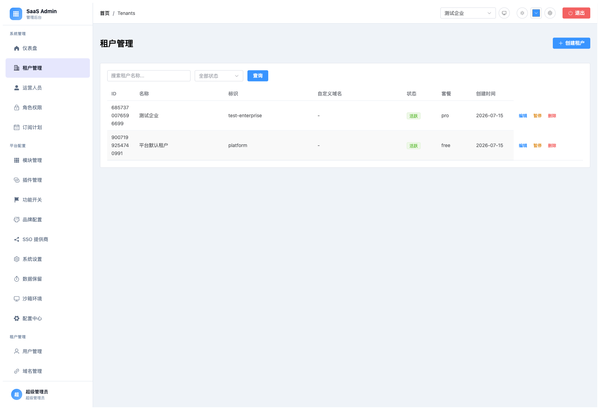
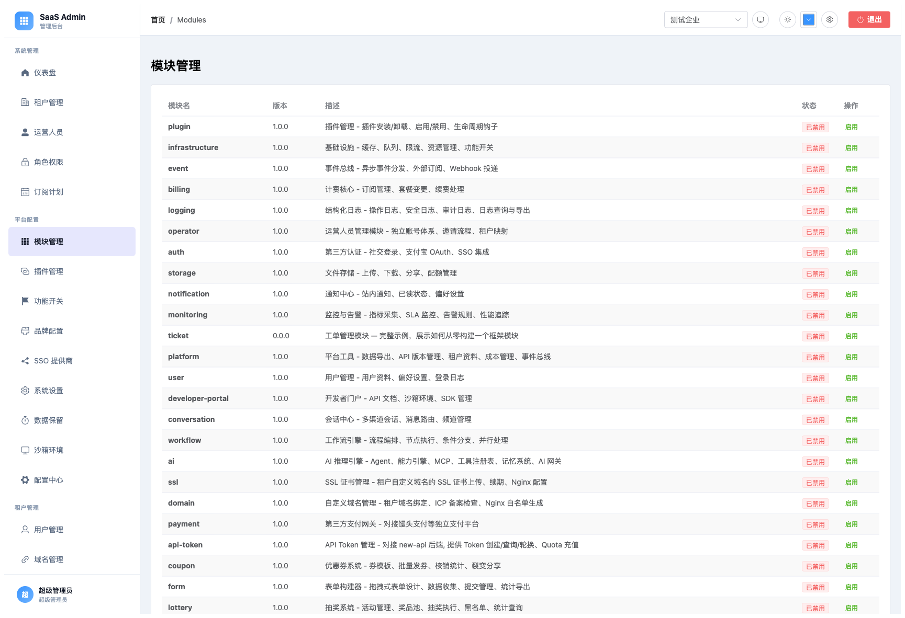
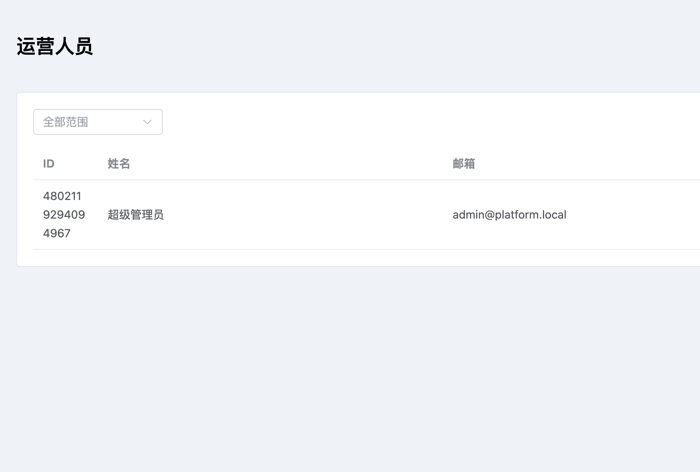
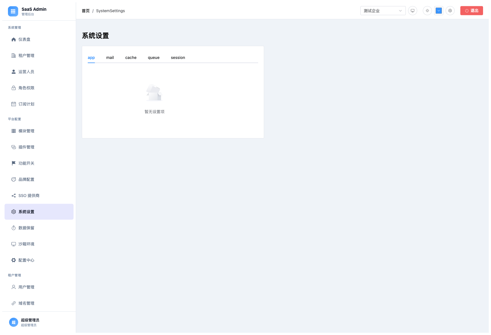
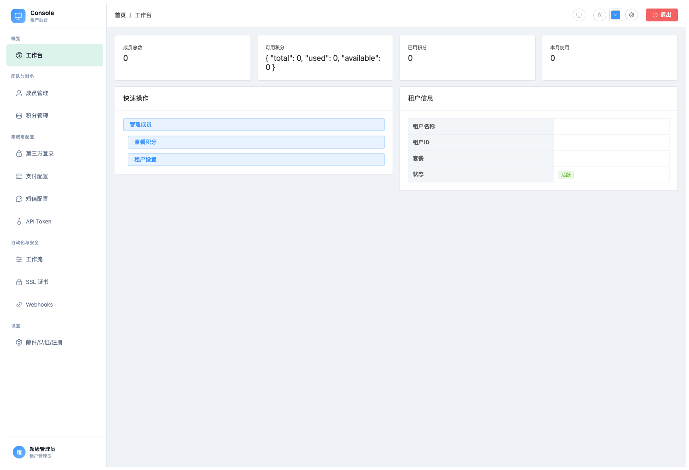
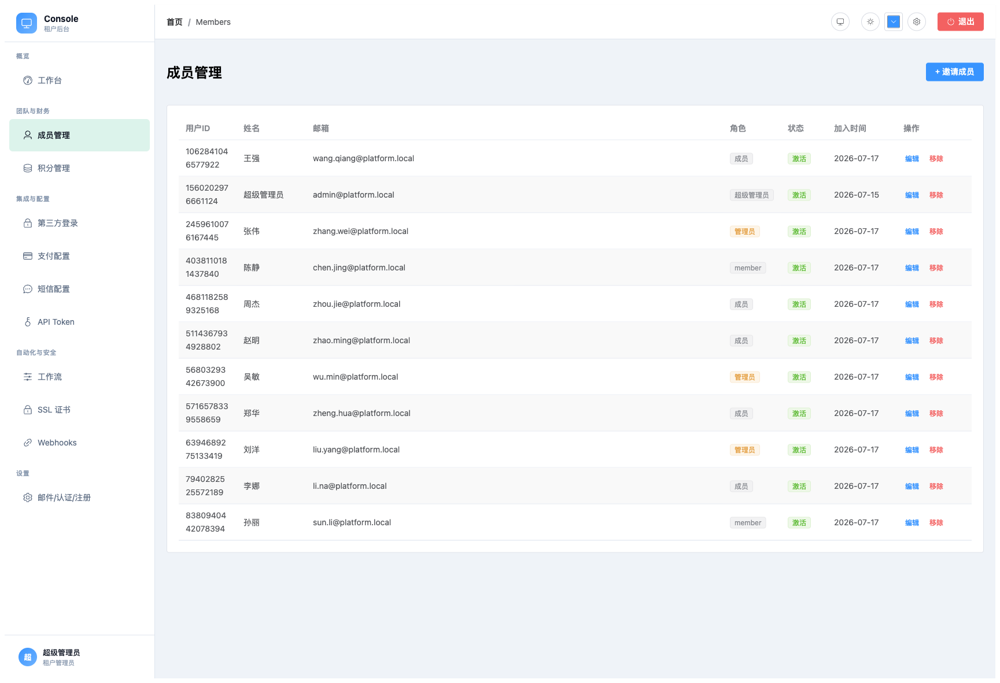
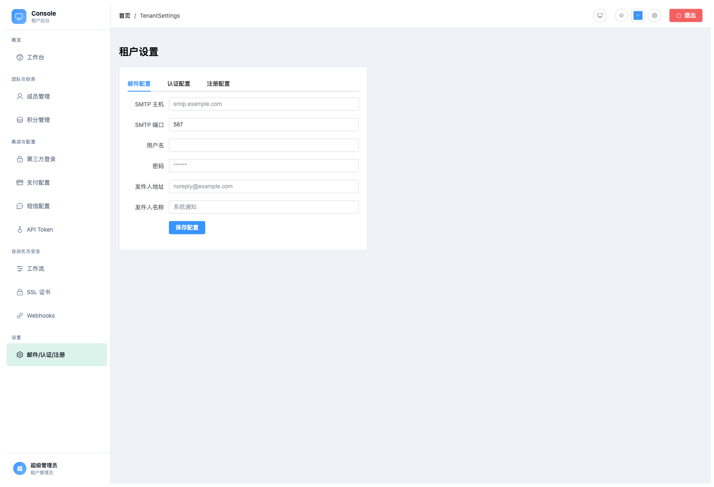

# Multi-Tenant SaaS Framework

Laravel 多租户 SaaS 基础框架 — 开箱即用的企业级项目骨架。

[](https://opensource.org/licenses/MIT)
[](https://php.net)
[](https://laravel.com)
[](#)

[Docs](docs/README.md) | [User Manual (中文)](docs/zh/user-manual.md) | [Quickstart](docs/en/guides/quickstart.md) | [安全审计](docs/zh/security/security-audit.md)

---

## Quick Start

### Option A: Create Project + Select Modules

```bash
composer create-project dsplat/multi-tenant-saas my-app
cd my-app

# Install modules as needed
composer require dsplat/multi-tenant-saas-module-billing
composer require dsplat/multi-tenant-saas-module-ai
composer require dsplat/multi-tenant-saas-module-form
```

### Option B: Preset Initialization

```bash
composer create-project dsplat/multi-tenant-saas my-app
cd my-app
php artisan tenancy:init normal   # mini(6) / normal(14) / full(22)
composer update
```

### Environment & Database

```bash
cp .env.example .env
php artisan key:generate
# Edit .env: DB_*, ADMIN_DOMAIN

php artisan migrate
php artisan platform:init --email=admin@example.com --password=your-password
```

### SPA Backends

```bash
# Build Admin SPA (Element Plus UI)
cd resources/js/admin && npx vite build

# Build Console SPA (Element Plus UI)
cd resources/js/console && npx vite build

# Start dev server
php artisan serve
# Admin: http://localhost:8000/admin/
# Console: http://localhost:8000/console/

# Development with hot reload
cd resources/js/admin && npx vite     # Admin dev server (default :5174)
cd resources/js/console && npx vite  # Console dev server (default :5173)
# Admin: http://localhost:5174/admin/
# Console: http://localhost:5173/console/
```

---

## Key Features

- **Four-Layer Access**: System admin → Tenant admin → End user → Guest
- **Tenant Isolation**: Auto `WHERE tenant_id = ?` on all queries
- **RBAC**: 89 permission nodes, custom roles per tenant
- **Global ID**: 16-digit random JS-safe IDs, no auto-increment
- **Multi-Payment**: WeChat, Alipay, PayPal, Stripe, UnionPay
- **AI Gateway**: Multi-provider (OpenAI/Claude/DeepSeek), Agent framework (8 templates)
- **SPA Backends**: 27 Admin pages + 12 Console pages, dual UI framework (Element Plus + Bootstrap)
- **26 Modules**: Billing, Auth, Form, Lottery, Voting, SMS, Coupon, Workflow, Conversation, etc.

---

## SPA Backends

### Admin (系统后台)

27 pages with full CRUD, tenant selector, dark mode support:

| Group | Pages |
|-------|-------|
| 概览 | 仪表盘, 租户管理, 运营人员, 角色权限, 订阅计划 |
| 平台配置 | 模块管理, 插件管理, 功能开关, 品牌配置, SSO, 系统设置, 数据保留, 沙箱, 配置中心 |
| 租户管理 | 用户, 域名, OAuth, 审计, 短信, 支付, Token, 配额, 积分, SSL, Webhooks, IP白名单, 租户密钥, 合规 |

### Console (租户后台)

12 pages with tenant-scoped operations:

| Group | Pages |
|-------|-------|
| 概览 | 工作台 |
| 团队与财务 | 成员管理, 积分管理 |
| 集成与配置 | 第三方登录, 支付配置, 短信配置, API Token |
| 自动化与安全 | 工作流, SSL 证书, Webhooks |
| 设置 | 邮件/认证/注册 |

### Theme System

- Light/Dark mode toggle
- Color picker (accent color flows through all UI)
- CSS variables on `:root` with `html.dark` overrides
- All badge/link/table colors use CSS variables (no hardcoded hex)

---

## Module Management

```bash
# Install / Uninstall
composer require dsplat/multi-tenant-saas-module-billing
composer remove dsplat/multi-tenant-saas-module-lottery

# CLI
php artisan module:list
php artisan module:enable billing
php artisan module:disable ssl
```

Each module is an independent Composer package on Packagist.

| Package | Type |
|---|---|
| `dsplat/multi-tenant-saas` | Core framework (includes `Contracts/ModuleServiceProvider` base class) |
| `dsplat/multi-tenant-saas-module-{name}` | 26 independent modules |

---

## Extending the Framework

### Adding a New Module

Create a complete module (database → API → frontend) without modifying the framework:

```
src/Modules/MyModule/
├── MyModuleServiceProvider.php    ← extends ModuleServiceProvider
├── composer.json                  ← extra.saas config
├── Database/migrations/           ← auto-loaded
├── Models/                        ← HasGlobalId + BelongsToTenant
├── Services/                      ← business logic
├── Http/Controllers/              ← ApiResponse + AuthorizesTenantAccess
├── Routes/
│   ├── api.php                    → /api/v1/...  (auth + tenant)
│   ├── admin.php                  → /v1/admin/... (auth)
│   ├── tenant.php                 → /tenant/... (auth)
│   └── public.php                 → /api/v1/...  (no auth)
└── resources/
    ├── admin/ui/element-plus/views/*.vue   → auto-discovered by sidebar
    └── console/ui/element-plus/views/*.vue → auto-discovered by sidebar
```

**See `src/Modules/Ticket/` for a complete working example.**

### Auto-Discovery

- **Backend**: `ModuleRegistry` scans `src/Modules/*/composer.json` `extra.saas`
- **Frontend**: `module-loader.ts` discovers `*.vue` files and auto-generates routes + sidebar entries
- **No framework modifications needed** — just create files in the right locations

---

## Architecture

```
dsplat/multi-tenant-saas (core package, type: library)
├── src/                          ← Framework library
│   ├── Concerns/                 # BelongsToTenant, HasGlobalId
│   ├── Context/                  # TenantContext
│   ├── Contracts/                # Interfaces + ModuleServiceProvider base
│   ├── Modules/                  # 26 modules (independent Composer packages)
│   └── Services/                 # Core services
├── resources/
│   ├── pages/                    # SPA entry points + UI frameworks
│   │   ├── admin/ui/{bootstrap,element-plus}/  # Admin pages
│   │   ├── console/ui/{bootstrap,element-plus}/ # Console pages
│   │   └── ui-core/              # Shared UI components + theme system
│   └── js/                       # SPA build configs, stores, routers
│       ├── admin/                # Admin SPA (Vite config, stores)
│       └── console/              # Console SPA (Vite config, stores)
├── app/                          # Project skeleton (HTTP layer)
├── config/                       # Configuration
├── server.php                    # PHP built-in server SPA routing fix
└── tests/                        # 2351 tests
```

---

## Screenshots

### Admin 后台

| Page | Screenshot |
|------|------------|
| 仪表盘 |  |
| 租户管理 |  |
| 模块管理 |  |
| 运营人员 |  |
| 系统设置 |  |

### Console 租户后台

| Page | Screenshot |
|------|------------|
| 工作台 |  |
| 成员管理 |  |
| 租户设置 |  |

---

## Docs

| Category | Links |
|---|---|
| **Guides** | [Quickstart (en)](docs/en/guides/quickstart.md) · [快速开始 (zh)](docs/zh/guides/quickstart.md) · [RBAC](docs/zh/guides/rbac-guide.md) · [AI Module](docs/zh/guides/ai-module-guide.md) |
| **Architecture** | [System Overview](docs/zh/architecture/system-overview.md) · [Tenant Isolation](docs/zh/architecture/tenant-isolation.md) · [Data Model](docs/zh/architecture/data-model.md) |
| **Deployment** | [Deployment Guide](docs/zh/deployment/deployment-guide.md) · [Nginx](docs/zh/deployment/nginx-guide.md) · [SPA Build](docs/spa-build-deploy.md) |
| **API** | [API Overview](docs/zh/api/api-overview.md) · [Core API](docs/zh/api/core-api.md) |
| **Full Index** | [docs/README.md](docs/README.md) (bilingual) |

---

## Tech Stack

PHP ^8.3 · Laravel ^13.0 · MySQL 8.0+ · Redis · Nginx + PHP-FPM · Vue.js 3 + TypeScript + Vite + Element Plus

## Testing

```bash
php -d memory_limit=512M vendor/bin/phpunit    # 2351 tests, 5915 assertions
vendor/bin/pint --test                          # Code style check
```

## License

MIT
