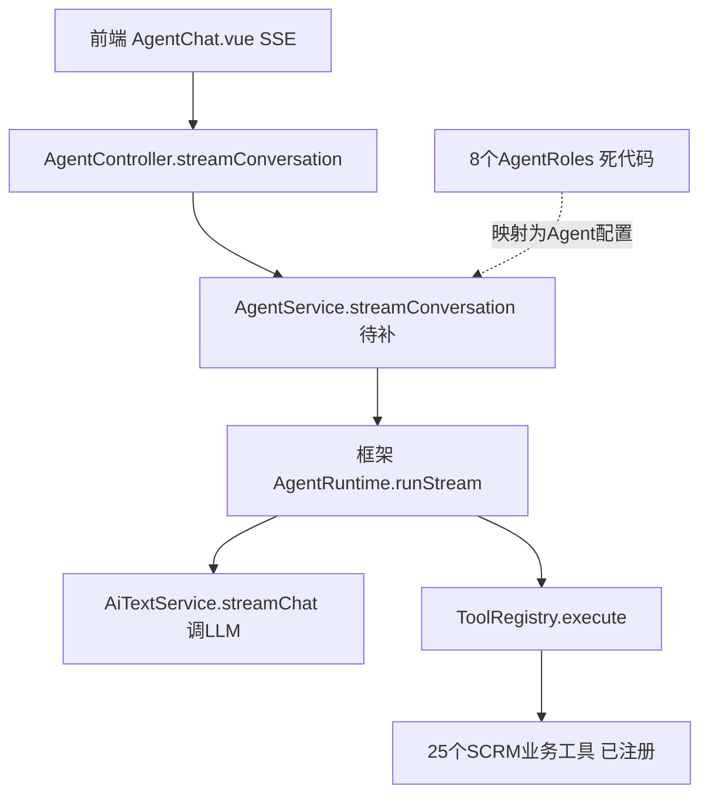
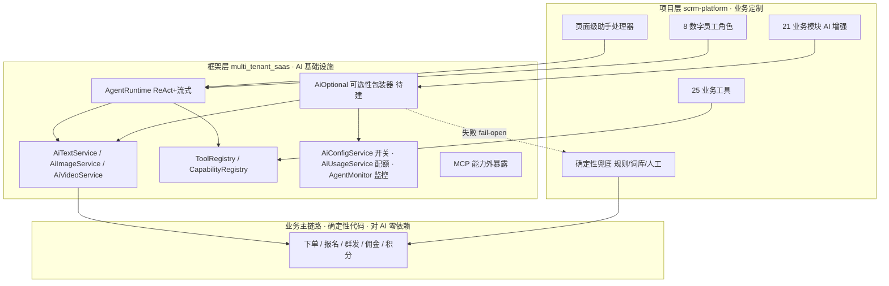
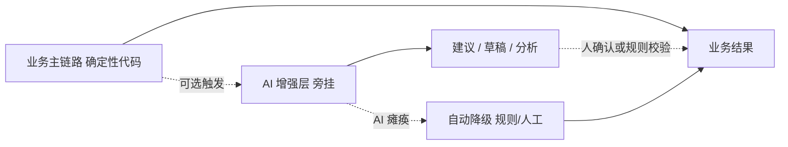
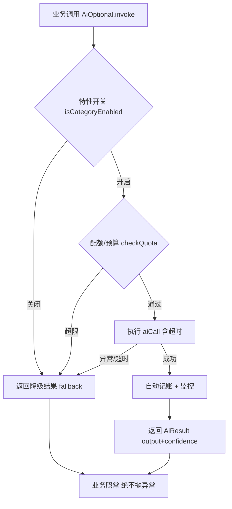
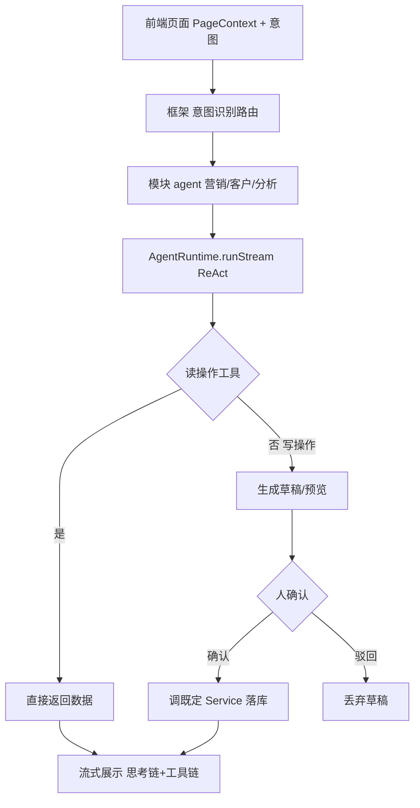
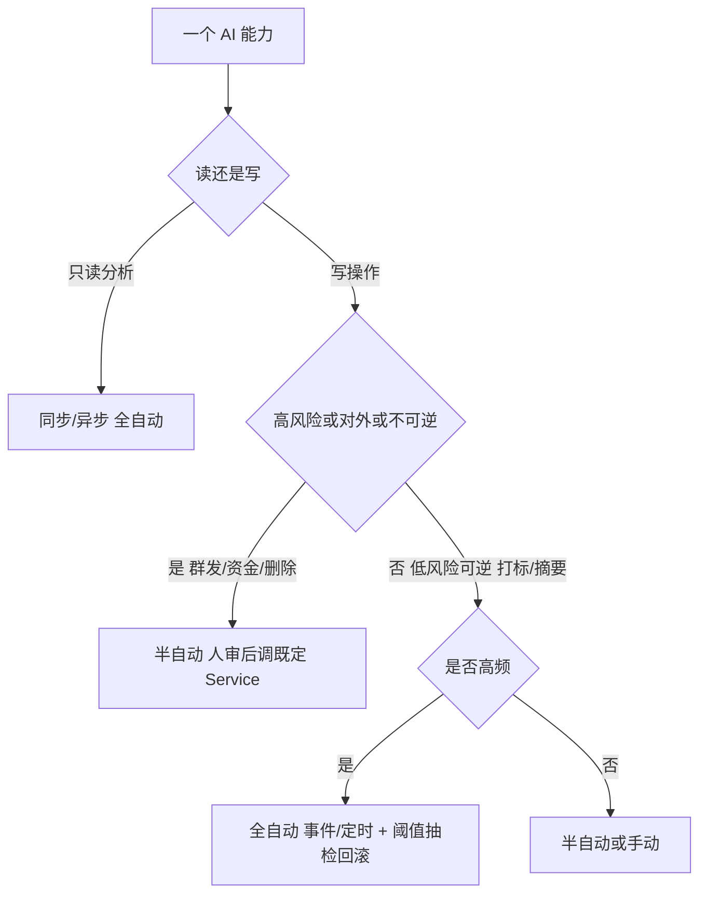

# AI 能力架构与使用方式设计

> 本文档七部分：
> - **第一部分**：AI 设计哲学（总纲）——确定性内核 + 智能性边缘；**最高原则：AI 可选性与业务零依赖（AI 瘫痪系统照常运转）**；现阶段铁律：运营者要清晰可靠的助手而非盲盒。
> - **第二部分**：框架与项目的 AI 接线现状诊断（架构思考）。
> - **第三部分**：AI 使用方式方法论——显式/隐式、手动/自动、全自动/半自动，以及网页调用 / 计划任务 / 事件驱动 / MCP Skills 等触发渠道。
> - **第四部分**：P0 模块 AI 能力契约（细化一）——Customer/Content/Marketing/Analytics/ChatArchive 的输入/输出/复用框架层/降级兜底。
> - **第五部分**：模块级 AI 应用图谱——21 个业务模块逐一分析 AI 可用环节 / 姿态 / 能力 / 降级兜底。
> - **第六部分**：AI 调用点降级规范（细化二）——`AiOptional` 可选性包装器（**框架层实现**）+ 项目复用范式。
> - **第七部分**：页面级 AI 助手协议与 agent 路由（细化三）——PageContext 上下文协议 + 框架路由/项目处理器分层。

---

# 第一部分：AI 设计哲学（总纲）

> **一句话本质：代码是「真理」，AI 是「大脑」。**
> 业务逻辑沉淀在确定性的代码模块里（简单、纯粹、可靠）；AI 只负责理解意图、动态编排、调用既定能力、分析数据、解释结果。
> **AI 永远不「实现」业务，只「使用」业务。** 这就是「确定性内核 + 智能性边缘」（deterministic core, intelligent edge）。

## 1. 六条基本原则

1. **系统即知识库**：代码、文档、核心业务流程、工具契约共同构成系统的知识库，让 AI 自己「知道怎么用这套系统」。优先从代码**自动生成**（路由表、工具 schema、模块清单），而非手写维护。
2. **外部知识常新**：定期更新所依赖的外部平台（微信 / 企业微信 / 支付宝等）的产品与帮助信息入库，让 AI 懂外部世界的规则与限制，并标注时效。
3. **业务由代码掌控**：业务的运转由确定性的代码逻辑明确控制，保证整个业务的简单、纯粹、可靠。这是整套哲学的锚点。
4. **AI 做编排与分析**：AI 的价值在于灵活组织、动态分析、调用这些设计好的能力、检查与分析数据，从而帮助用户——而非替业务「写逻辑」。
5. **触发器与执行体分离**：即便是定时 / 事件触发，执行体依然是设计好的事务、逻辑模块、MCP。触发器（Cron / 事件 / 网页 / 外部 Agent）只负责「何时做」，执行体永远确定。
6. **能力可被组合调用**：一键填表、一键建活动、页面级帮助与分析，本质都是 AI 调用既定逻辑完成，可按域分别调用不同的 agent，再由编排者路由。

## 2. 现阶段铁律：可靠与清晰，高于聪明

> **运营者需要的是清晰、可靠的 AI 助手，而不是盲盒。至少，现阶段是这样。**

LLM 本质是概率性的、不透明的。让它值得信赖的唯一办法，是把它**关进确定性的笼子里，并把每一步暴露在阳光下**。「盲盒」与「助手」的分野：

| 运营者的诉求 | 盲盒（不可接受） | 清晰可靠的助手（目标） |
|------------|----------------|----------------------|
| 可预期 | 不知道它会做什么 | 能力清单公开，做之前知道它「能做什么、将做什么」 |
| 可看见 | 黑箱出结果 | 实时展示正在调用哪个能力、传了什么参数（思考链 / 工具链可见） |
| 可理解 | 给个结果不知为何 | 每个结论附带依据（引用了哪些数据、规则、来源） |
| 可信赖 | 同样输入不同输出 | 调用确定性能力，输出稳定；分析类标注置信度 |
| 可控制 | 自作主张、不可逆 | 高风险动作先预览后确认（人在环），随时可叫停 |
| 可回退 | 错了无法追溯 | 全程审计留痕，可撤销、可复盘、可追责 |

**阶段演进观**（自主权随信任与基建成熟逐步放权，但透明底线不降）：

| 阶段 | 特征 | 自主权 |
|------|------|--------|
| 阶段一（当前） | 清晰可靠的助手：每步可见、高风险人审、只读分析为主 | 半自动为主 |
| 阶段二 | 受监督的自动：低风险隐式 AI 全自动（打标 / 质检 / 摘要），配阈值 + 抽检 + 回滚 | 低风险全自动 |
| 阶段三 | 自主编排：多 agent 协作完成复杂任务，人只看结果与异常 | 编排自动、决策可抽查 |

## 3. AI 能力准入清单（上线前自检，反盲盒落地）

每个 AI 能力上线前必须满足：

- [ ] **契约化**：调用的是已注册、有 schema 的既定能力（Tool / Service / MCP），而非临场发挥
- [ ] **可预览**：写操作执行前展示「将要做什么」，高风险须人确认
- [ ] **可解释**：输出附带依据（数据来源 / 规则 / 提示词要点）
- [ ] **可观测**：调用链（工具 / 参数 / 耗时 / token）记录到 `AgentMonitor` / `AiUsageService`
- [ ] **幂等**：写操作带业务唯一键，AI 重试不造成重复副作用
- [ ] **有界**：受租户权限 + 能力白名单约束，写操作默认半自动
- [ ] **可降级**：AI 失败时优雅回退（`class_exists` 检测、mock driver），不阻断主业务
- [ ] **可回退**：产生的变更可撤销 / 可追责

## 4. 知识库的两个来源

- **内部知识（系统自知）**：代码 + 文档 + 核心业务流程 + 工具契约 → 让 AI 知道「系统有什么能力、怎么调」。原则：**能从代码实时生成的就不手维护**（路由 / 工具 schema / 模型清单），避免文档失真。
- **外部知识（世界常新）**：微信 / 企业微信 / 支付宝等平台的产品与帮助信息 → 用**计划任务**定期抓取、版本化、打时效标签；AI 引用时带时间戳，过期提醒刷新。

## 5. 四面承重墙（不可逾越的底线）

1. **能力边界即安全边界**：AI 能调什么，由 `ToolRegistry` / MCP 注册清单 + 租户权限决定；写操作（对外发送 / 资金 / 删除）默认半自动，读操作可放开。
2. **能力必须幂等可重放**：AI 会重试、会编排错序，既定能力须幂等（业务唯一键），避免重复下单 / 重复群发。
3. **严防代码生成型 AI 反噬**：`LiveCodeToolHandler` 类能力严格限定为**只读分析 / 取数**，**禁止用它现场写业务逻辑**——否则业务逻辑漂移，「简单纯粹可靠」崩塌。这是本哲学最大的潜在破坏点。
4. **知识库新鲜度治理**：内部知识从代码自动生成，外部知识计划任务刷新 + 时效标签，AI 引用带时间戳。

## 6. 最高原则：AI 可选性与业务零依赖（降级铁律）

> **即使 AI 完全瘫痪，系统流转不受任何影响。**
> AI 功能强大——可以一键创建一个完美的活动；但运营者也完全可以不需要它。**任何 AI 操作都不得干预、阻断或污染业务流程。**

这不是「AI 只读不写」——AI 可以写（一键建活动、智能群发、自动打标），但必须满足：

1. **旁挂而非串联**：AI 是挂在业务主链路**旁边**的增强层，绝不在关键路径上。业务事务（下单 / 报名 / 群发 / 佣金结算 / 积分）由确定性代码完成，AI 只在其前后做「建议 / 草稿 / 分析 / 触发」。
2. **写操作必经既定服务**：AI 的「写」永远是**调用**既定 Service（如 `EventService::create`），而非自己实现业务。AI 瘫痪时，同一功能的人工入口照常可用。
3. **默认降级（fail-open）**：每个 AI 调用点必须有「AI 不可用时」的确定性兜底——规则引擎、关键词匹配、人工流程。AI 报错 / 超时 / 配额耗尽，业务照常流转。
4. **可被完全关闭**：每个 AI 增强点有独立开关（租户级 / 全局 feature flag），关掉后系统行为与无 AI 时完全一致。
5. **非阻塞**：AI 分析类一律异步（队列 / 定时），不占用业务请求的关键时间；同步 AI（对话）也要有超时与降级。

**工程落地约束（每个 AI 调用点必须做到）：**

- 同步调用：`class_exists` 检测 + try/catch + 超时 + 降级返回值，绝不向业务抛异常。
- 异步调用：AI Job 失败只记录与重试，业务主流程不等它、不依赖它的结果。
- 特性开关：AI 功能用 feature flag 包裹，可一键关停。
- 结果标注：AI 产出明确标记为「AI 建议」，写操作须经人确认或既定规则校验。
- 独立可观测：AI 调用走 `AiUsageService` / `AgentMonitor`，AI 故障可独立告警，不影响业务监控。

## 7. 框架 AI 能力类型（供模块选用的「能力菜单」）

| 能力类型 | 框架载体 | 说明 | 降级方式 |
|---------|---------|------|---------|
| 文本生成 | `AiTextService::complete/chat` | 文案 / 摘要 / 话术 / 报告 | 人工编辑 / 模板 |
| 对话推理（ReAct） | `AgentRuntime::run/runStream` | 多轮对话 + 工具调用循环 | 转人工 / 关键词机器人 |
| 图像生成 | `AiImageService` | 海报 / 配图 / 提示词成图 | 模板渲染 / 人工设计 |
| 视频生成 | `AiVideoService` | 短视频脚本 / 素材 | 人工制作 |
| RAG 检索问答 | `Knowledge` 模块 + 外部 KB | 基于知识库的问答 | 关键词搜索 |
| 数据分析 | `AiTextService` + 取数工具 | 异常检测 / 趋势 / 洞察 | 固定报表 / 人工分析 |
| 能力外暴露 | `McpToolRegistry` / `McpSkillGenerator` | 把平台能力给外部 AI 调用 | 关闭 MCP 端点 |

## 8. 分层原则与框架复用边界（架构铁律）

> **分层要清晰：框架层该实现的，就由框架层实现；框架层已实现的，项目必须复用框架层。**

### 框架层（multi_tenant_saas）——提供 AI 基础设施

| 能力 | 框架载体 | 状态 |
|------|---------|------|
| 推理服务（文本/图像/视频/embedding） | `AiTextService` / `AiImageService` / `AiVideoService` / `AiGatewayService` | ✅ 已实现 |
| Agent 运行时（ReAct + 流式 + 记忆压缩 + 降级容错） | `AgentRuntime`（`run`/`runStream`/`continueWithToolResults`/`compressMemory`） | ✅ 已实现 |
| 工具注册与执行 | `ToolRegistry` + `ToolRegistryContract` + 13 内置工具 | ✅ 已实现 |
| 能力抽象 | `CapabilityRegistry` + `CapabilityContract` + `CapabilityResult`（自带 confidence/tokenUsage/durationMs） | ✅ 已实现 |
| **特性开关（租户级）** | `AiConfigService::isCategoryEnabled/enableCategory/disableCategory` | ✅ 已实现 |
| **配额 / 预算闸门** | `AiUsageService::checkQuota/checkBudget/checkOverage` + `record*Usage` | ✅ 已实现 |
| **可观测** | `AgentMonitor`（logConversationTurn/logToolCall/getTokenUsage/getCostEstimate） | ✅ 已实现 |
| MCP 能力外暴露 | `McpToolRegistry` / `McpSkillGenerator` | ✅ 已实现 |
| **可选性降级包装器 `AiOptional`** | 统一 fail-open 入口（开关+配额+try/catch+超时+降级+自动监控） | ⬜ **待框架新增** |

### 项目层（scrm-platform）——只做业务定制，一律复用框架

- **业务工具**：25 个 SCRM 工具注册进框架 `ToolRegistry`（已做）。
- **数字员工角色**：8 个 AgentRoles 落库为框架 `Agent` 模型配置（待做）。
- **模块 AI 增强**：各模块经 `AiOptional` 包装器调用框架推理服务，绝不直连 provider。
- **提示词与上下文工程**：模块专属 prompt 模板、页面上下文组装（项目业务）。
- **页面级助手处理器**：各模块的上下文提供器 + 动作执行器（调既定 Service）。
- **降级兜底规则**：各模块的确定性 fallback（规则引擎 / 词库 / 人工流程）。

### 复用红线（项目层禁止重复造轮子）

| 禁止自建 | 必须复用框架 |
|---------|------------|
| 推理客户端 / HTTP 调 LLM | `AiTextService` / `AiImageService` / `AiGatewayService` |
| ReAct 循环 / 工具调用编排 | `AgentRuntime` |
| 工具注册表 | `ToolRegistry` |
| 特性开关 | `AiConfigService::isCategoryEnabled` |
| 配额 / 计费 | `AiUsageService` |
| 调用监控 | `AgentMonitor` |
| 降级包装 | `AiOptional`（框架待建，建成后项目统一复用） |

### 框架层待建清单（汇总 · 按优先级）

> 以下三项是「框架层该实现」但当前缺失的能力，建成后由所有项目复用（详见第六、七部分）：

| 待建能力 | 落点 | 优先级 | 详见 |
|---------|------|--------|------|
| `AiOptional` 可选性降级包装器 | `MultiTenantSaas\Modules\Ai\Services` | P0 | 第六部分 |
| PageContext 上下文协议 + SDK | 框架（前后端契约） | P1 | 第七部分 |
| 意图识别 + 路由分发器 | 框架（可用「路由 agent」实现） | P1 | 第七部分 |

---

# 第二部分：AI 接线现状诊断

## 1. 框架提供的 AI 能力（multi_tenant_saas，已就绪）

框架有一套**完整的 ReAct Agent 运行时**，是真正能跑 LLM + 工具循环的引擎：

| 层 | 组件 | 能力 |
|----|------|------|
| 推理层 | `AiTextServiceContract` | `chat()` / `complete()` / `streamChat()`，driver 抽象（laravel-ai / mock） |
| 多模态 | `AiImageService` / `AiVideoService` | 图像、视频生成 |
| Agent 运行时 | `AgentRuntime` | `run()` / `runStream()`（SSE 流式）/ `continueWithToolResults()` / `compressMemory()`，内置 **ReAct 循环 + 工具调用 + 记忆压缩 + 降级容错** |
| 工具系统 | `ToolRegistry` + `ToolRegistryContract` | 工具注册/定义/执行，含 13 个内置工具（Database/Http/Cache/Queue/Email…） |
| MCP | `McpToolRegistry` / `McpSkillGenerator` | MCP 协议工具，可把能力暴露给外部 AI 工具 |
| 治理 | `AiConfigService` / `AiUsageService` / `CapabilityRegistry` / `AgentMonitor` | 租户配置、用量计费、能力注册、监控 |

**关键点**：框架的 `AgentRuntime` 已实现完整的"LLM 思考→调工具→再思考"循环和流式输出，**项目不需要自己造轮子**。

## 2. 项目 AI 员工层现状（scrm-platform，骨架在、引擎缺）

```
app/Modules/AI/
├── AgentService.php          ✅ Agent CRUD + 工具绑定 + 把 25 个业务工具注册进框架 ToolRegistry
├── AgentConversationService  ✅ 仅持久化/统计（不调 AI）
├── AgentRoleService          ✅ 走数据库 AgentRole 模型
├── AgentCoordinator.php      ❌ 37 行纯占位桩（返回 mock 'dispatched'）
└── Http/AgentController      ⚠️ streamConversation 调用 AgentService::streamConversation()
app/Services/Tools/           ✅ 25 个业务工具（客户/消息/分析/质检…）已注册
app/AgentRoles/               ❌ 8 个数字员工类，全库零引用（死代码）
config/agent-roles.php        ❌ 未被读取
```

## 3. 接线的真实断点（核心结论）

- **AI 员工对话后端是断的**：`AgentController::streamConversation` 调用了 `$this->agentService->streamConversation(...)`，但 `AgentService` **没有这个方法**——前端发起 AI 员工对话即报错。
- **全项目唯一正确接线的只有 Event 模块**——`EventAiService::callAiText` 是标准范式：
  ```php
  $aiService = app(\MultiTenantSaas\Modules\Ai\Services\AiTextService::class);
  $response = $aiService->chat($messages, [...]);   // class_exists 优雅降级
  ```

## 4. 接线路径（盘活三步）



1. **补 `AgentService::streamConversation`**：注入 `AgentRuntimeContract`，调 `runStream($agentId, $conversationId, $message)`，把框架 StreamChunk 转成前端 SSE 格式。25 个已注册工具会被框架自动调用。
2. **激活 8 个数字员工**：把 `app/AgentRoles/` + `config/agent-roles.php` 的角色定义（能力/工具/提示词）落库为 Agent 配置。
3. **删除/替换占位桩**：`AgentCoordinator` 要么接框架运行时，要么移除。

---

# 第三部分：AI 使用方式方法论

架构只是地基。真正的价值在于：**在什么场景、以什么姿态、由谁触发、用多大自主权去使用 AI。** 下面用四个正交维度 + 触发渠道来刻画。

## 1. 四个正交维度

### 维度 A：显式 vs 隐式（用户是否感知到 AI）

| 姿态 | 定义 | SCRM 场景举例 |
|------|------|--------------|
| **显式** | 用户主动发起、明确知道在和 AI 交互 | AI 员工对话、AI 生成文案/海报、AI 问答 |
| **隐式** | AI 在后台默默增强，用户无感 | 客户自动打标签、会话情感/意图识别、内容合规审核、异常检测、智能排序/推荐 |

> 经验：**显式做体验，隐式做质量。** 隐式 AI 往往 ROI 更高（用户无需学习、无等待感），但需要可解释与可回滚。

### 维度 B：手动 vs 自动（触发主体）

| 触发 | 定义 | 场景举例 |
|------|------|---------|
| **手动** | 人点按钮/发问触发 | 点"生成活动文案"、向数字员工提问 |
| **自动** | 系统事件或时间触发，无需人参与 | 新客户进来自动画像、每日 0 点自动生成日报、会话结束自动质检 |

### 维度 C：全自动 vs 半自动（AI 自主权 / 人在环）

| 自主权 | 定义 | 适用 | 风险 |
|--------|------|------|------|
| **全自动** | AI 决策并直接执行，无人审核 | 低风险、可逆、高频：打标签、情感标注、内部摘要 | 错误会规模化，需阈值/抽检/回滚 |
| **半自动** | AI 产出草稿/建议，人确认后执行 | 高风险、对外、不可逆：群发客户、营销方案、海报发布、退款 | 安全，但有人工瓶颈 |

> **设计原则：按"风险 × 可逆性"分配自主权。** 对外发送、资金、删除类一律半自动（human-in-the-loop）；内部标注、统计、摘要类可全自动。

### 维度 D：同步 vs 异步（执行时机）

| 时机 | 实现 | 适用 |
|------|------|------|
| **同步** | HTTP 请求内即时返回（含 SSE 流式） | 对话、即时生成（秒级） |
| **异步** | 队列 Job / 计划任务 | 批量、耗时、定时（海报批量渲染、日报、全量打标） |

## 2. 触发渠道（AI 从哪里被唤起）

| 渠道 | 机制 | 框架/项目支撑 | 典型场景 |
|------|------|--------------|---------|
| **网页调用（Console）** | 管理后台按钮/对话 → API → AiTextService/AgentRuntime | 已有（AgentChat.vue + SSE） | 运营手动生成、数字员工对话 |
| **网页调用（H5/C 端）** | 客户端请求 → API | 已有（uni-app） | 客户侧 AI 问答、智能客服 |
| **计划任务（Cron）** | Laravel Schedule → Command → Queue Job → AI | 框架有 queue/schedule | 每日报表、定时巡检、批量打标、数据复盘 |
| **事件驱动（自动）** | 领域事件 → Listener → Queue Job → AI | 框架有 Events/Listeners | 新客户→自动画像；会话结束→自动质检/摘要；订单异常→预警 |
| **MCP / 外部 AI Skills** | 把平台能力封装为 MCP Tool/Skill，供 Cursor/Claude/Qoder 等外部 AI 调用 | 框架有 `McpToolRegistry`/`McpSkillGenerator`，项目有 `api/v1/mcp` 端点 | 在 IDE/外部 Agent 里直接查客户、发报告、操作平台 |
| **Webhook / 第三方回调** | 企微/渠道消息回调 → 路由 → AI | 项目有 Channel 驱动 | 客户发消息→AI 自动回复/转人工 |

## 3. 决策矩阵：场景 → 维度组合

| 业务场景 | 显隐 | 触发 | 自主权 | 时机 | 渠道 |
|---------|------|------|--------|------|------|
| 数字员工对话 | 显式 | 手动 | 半自动（对外发送需确认） | 同步流式 | Console/H5 |
| AI 生成活动文案 | 显式 | 手动 | 半自动（人审后发布） | 同步 | Console |
| AI 海报合成 | 显式 | 手动 | 半自动 | 异步（耗时） | Console |
| 客户自动打标签 | 隐式 | 自动（事件） | 全自动 | 异步 | 事件驱动 |
| 会话情感/意图识别 | 隐式 | 自动（事件） | 全自动 | 异步 | 事件驱动 |
| 会话自动质检评分 | 隐式 | 自动（事件） | 全自动（低分转人工复核） | 异步 | 事件驱动 |
| 每日经营日报 | 显式（推送） | 自动（定时） | 全自动 | 异步 | 计划任务 |
| 客户流失预警 | 隐式 | 自动（定时+事件） | 半自动（预警给人） | 异步 | 计划任务 |
| 智能客服自动回复 | 显式 | 自动（Webhook） | 半自动（不确定转人工） | 同步 | Webhook |
| 外部 AI 操作平台 | 显式 | 手动（外部 Agent） | 半自动（受 MCP 权限约束） | 同步 | MCP Skills |

## 4. 落地建议（基于框架既有能力）

1. **统一入口收敛到框架运行时**
   - 显式对话类 → `AgentRuntime::runStream()`（流式）/ `run()`（同步）。
   - 隐式/批量类 → `AiTextService::complete()` 包进 Queue Job。
   - 杜绝项目内自造 ReAct 循环（当前 `AgentCoordinator` 占位桩应移除）。

2. **建立"AI 触发器"三件套**
   - **事件触发器**：在 `app/Modules/*/Events` 上挂 Listener，把"新客户/会话结束/订单异常"等事件接到隐式 AI Job。
   - **计划触发器**：在 `app/Console/Commands` 增加 `ai:daily-report`、`ai:relabel` 等命令并注册到 Schedule。
   - **MCP 触发器**：用框架 `McpSkillGenerator` 把高价值只读能力（查客户、查报表）先生成 Skill，外部 AI 只读优先，写操作受权限闸门约束。

3. **自主权闸门（半自动的统一机制）**
   - 引入"AI 草稿 → 待审 → 执行"状态机：对外发送/资金/删除类产出先进 `pending` 队列，Console 提供一键确认/驳回。
   - 全自动类设置**置信度阈值 + 抽检 + 一键回滚**，避免错误规模化。

4. **可观测与计费**
   - 所有 AI 调用走框架 `AiUsageService`/`AgentMonitor`，按租户/场景统计 token 与成本，识别高 ROI 与高浪费场景。

5. **隐式 AI 的可解释**
   - 隐式标注（标签/情感/质检）须落"依据"字段（AI 给出的理由），供人工复核与纠错，形成数据飞轮。

## 5. 优先级建议

| 优先级 | 动作 | 理由 |
|--------|------|------|
| P0 | 补 `AgentService::streamConversation` 接通 `AgentRuntime` | 修复当前断点，盘活数字员工对话 |
| P0 | 激活 8 个 AgentRoles 落库 | 让数字员工有"角色/工具/提示词" |
| P1 | 事件驱动隐式 AI（自动打标/会话质检） | ROI 最高、用户无感 |
| P1 | 计划任务日报/预警 | 体现"自动"价值，演示效果好 |
| P2 | MCP Skills 只读能力外暴露 | 接入外部 AI 生态，差异化亮点 |
| P2 | 半自动审批状态机 | 保障对外/资金类安全 |

---

# 第四部分：P0 模块 AI 能力契约（细化一）

> 将 P0 模块（Customer / Content / Marketing / Analytics / ChatArchive）的 AI 应用点细化为**可实施的能力契约**：输入 / 输出 / 复用框架层 / 项目层补充 / 降级兜底 / 可观测。
> 所有能力统一经框架 `AiOptional` 包装器调用（见方向二）；「复用框架层」列即分层铁律的落地。

## 1. Customer 客户

| 能力 | 输入 | 输出 | 复用框架层 | 项目层补充 | 触发/自主 | 降级兜底 |
|------|------|------|-----------|-----------|----------|---------|
| 客户自动打标 | 客户 ID、近 N 条会话/行为 | 标签 ID 列表 + 置信度 + 依据 | `AiTextService::complete` | 标签体系 prompt、`AutoTagService` 落库 | 事/全 | 规则打标；低置信度跳过 |
| 客户画像摘要 | 客户档案 + 跟进记录 | 200 字摘要 | `AiTextService::complete` | 摘要模板、缓存 | 事/全 | 字段展示，无摘要 |
| 跟进建议 | 当前客户上下文 | 下一步动作建议 | `AiTextService::chat` | 销售 SOP prompt | 手/半 | 通用话术模板 |
| 流失预测预警 | 客户活跃/交易特征 | 流失概率 + Top 因素 | `AiTextService::complete` | 取数工具、阈值 | 时/半 | 固定活跃度规则 |
| 合并冲突识别 | 两客户档案 | 是否同一人 + 依据 | `AiTextService::complete` | 合并规则 | 手/半 | `CustomerMergeService` 规则 |

## 2. Content 内容

| 能力 | 输入 | 输出 | 复用框架层 | 项目层补充 | 触发/自主 | 降级兜底 |
|------|------|------|-----------|-----------|----------|---------|
| 话术/文案生成 | 场景、产品、风格 | 文案候选 N 条 | `AiTextService::complete` | 话术模板、品牌调性 | 手/半 | 人工编辑 |
| 内容质检评分 | 会话/内容文本 | 评分 + 扣分项 + 依据 | `AiTextService::complete` | 质检规则 prompt | 事/全 | `QualityInspectionPipeline` 规则 |
| 敏感词/合规检测 | 文本 | 命中词 + 风险等级 | `AiTextService::complete` | 敏感词库 | 事/全 | `SensitiveWordService` 词库 |
| 素材效果分析 | 素材曝光/互动数据 | 洞察 + 推荐 | `AiTextService::complete` | 取数工具 | 时/全 | `MaterialStatsService` 报表 |

## 3. Marketing 营销

| 能力 | 输入 | 输出 | 复用框架层 | 项目层补充 | 触发/自主 | 降级兜底 |
|------|------|------|-----------|-----------|----------|---------|
| 活动文案/创意生成 | 活动类型、目标、调性 | 文案 + 标题候选 | `AiTextService::complete` | 营销 prompt 库 | 手/半 | 人工撰写 |
| 海报合成 | 活动主题、素材 | 海报图 URL | `AiImageService::textToImage` | `PosterRenderService` 版式 | 手/半 | 模板渲染 |
| A/B 文案变体 | 基准文案 | N 个变体 | `AiTextService::complete` | `AutomationABTestService` | 手/半 | 人工多版本 |
| 触达时机/人群推荐 | 历史触达数据 | 推荐人群 + 时段 | `AiTextService::complete` | 取数工具 | 时/半 | `RuleEngineService` 规则 |
| 效果归因分析 | 活动全链路数据 | 归因报告 | `AiTextService::complete` | 取数工具 | 时/全 | `ReachAnalyticsService` 报表 |
| 一键创建活动 | 自然语言需求 | 活动草稿表单 → 调 `CampaignService::store` | `AgentRuntime::run` + 工具 | 活动字段填充工具 | 手/半 | 人工填表 |

## 4. Analytics 分析

| 能力 | 输入 | 输出 | 复用框架层 | 项目层补充 | 触发/自主 | 降级兜底 |
|------|------|------|-----------|-----------|----------|---------|
| 日报/周报生成 | 时间范围、指标集 | 图文报告 | `AiTextService::complete` | 取数工具、报告模板 | 时/全 | 固定报表 |
| 数据异常检测 | 指标时序 | 异常点 + 可能原因 | `AiTextService::complete` | 取数工具、阈值 | 时/半 | 固定阈值告警 |
| 自然语言查数 | 自然语言问题 | 数据结果 + 图表 | `AgentRuntime::run` + 只读取数工具 | 取数工具（只读） | 手/只读 | 人工查报表 |
| 经营洞察/归因 | 多维数据 | 洞察结论 + 依据 | `AiTextService::complete` | 取数工具 | 手/只读 | 人工分析 |

## 5. ChatArchive 会话存档

| 能力 | 输入 | 输出 | 复用框架层 | 项目层补充 | 触发/自主 | 降级兜底 |
|------|------|------|-----------|-----------|----------|---------|
| 会话质检 | 会话文本 | 违规项 + 评分 + 依据 | `AiTextService::complete` | 质检规则 prompt | 时/全 | 人工抽检 |
| 会话摘要/关键信息 | 会话文本 | 摘要 + 意向 + 待办 | `AiTextService::complete` | 提取模板 | 事/全 | 原始会话展示 |
| 会话语义搜索 | 查询语句 | 相关会话片段 | `AiGatewayService::embed` + 向量检索 | 向量索引 | 手/只读 | 关键词搜索 |
| 客户意向识别 | 会话文本 | 意向等级 + 依据 | `AiTextService::complete` | 意向分级 prompt | 事/全 | 人工判断 |

---

# 第五部分：模块级 AI 应用图谱（21 模块总览）

> 对 scrm-platform 全部 21 个业务模块逐一分析：**核心职责 → AI 可用环节 → 使用姿态 → AI 能力 → AI 瘫痪时业务如何照常**。
> 所有 AI 环节均受第一部分「可选性铁律」约束：旁挂、可降级、可关闭、写操作必经既定服务。

**图例**：姿态 = 显 / 隐（显式 / 隐式）；触发 = 手 / 事 / 时 / 外（手动 / 事件 / 定时 / 外部）；自主权 = 全 / 半（全自动 / 半自动）；能力 = 文 / 对 / 图 / 视 / RAG / 析（文本 / 对话ReAct / 图像 / 视频 / 检索问答 / 数据分析）。

## 1. Customer 客户（CRM 核心）

- **核心职责**：客户档案、标签、分组、跟进、销售管道、客户旅程、合并、导入导出。
- **AI 应用点**：
  | 环节 | 姿态 | 触发 | 自主权 | 能力 | AI 瘫痪时 |
  |------|------|------|--------|------|----------|
  | 客户自动打标（基于会话/行为） | 隐 | 事 | 全 | 文 | `AutoTagService` 规则打标 |
  | 客户画像/摘要生成 | 隐 | 事 | 全 | 文 | 字段展示，无摘要 |
  | 跟进建议 / 会话小结 | 显 | 手 | 半 | 文 | 人工填写 |
  | 流失预测预警 | 隐 | 时 | 半（预警） | 析 | 人工巡检 |
  | 客户合并冲突智能识别 | 隐 | 手 | 半 | 文 | `CustomerMergeService` 规则 |
- **AI 瘫痪影响**：无。规则打标 / 手动跟进 / 人工分组全部可用。

## 2. Channel 渠道（微信/企微）

- **核心职责**：微信/企微对接、渠道码、模板消息、菜单、欢迎语、回调路由。
- **AI 应用点**：
  | 环节 | 姿态 | 触发 | 自主权 | 能力 | AI 瘫痪时 |
  |------|------|------|--------|------|----------|
  | 智能客服自动回复 | 显 | 外（回调） | 半（不确定转人工） | 对 | 关键词路由 + 人工 |
  | 欢迎语/菜单文案生成 | 显 | 手 | 半 | 文 | 人工编辑 |
  | 消息意图识别路由 | 隐 | 事 | 全 | 文 | `MessageRouterImpl` 规则 |
- **AI 瘫痪影响**：无。关键词机器人 + 人工客服照常。

## 3. Community 社群

- **核心职责**：社群管理、群机器人、群发、打卡、朋友圈 SOP、话题接龙。
- **AI 应用点**：
  | 环节 | 姿态 | 触发 | 自主权 | 能力 | AI 瘫痪时 |
  |------|------|------|--------|------|----------|
  | 群机器人智能应答 | 显 | 外 | 半 | 对/RAG | `GroupBotService` 关键词规则 |
  | 群活跃度/健康度分析 | 隐 | 时 | 全 | 析 | `CommunityAnalyticsService` 固定指标 |
  | 群发文案生成 | 显 | 手 | 半 | 文 | 人工编辑 |
  | 群舆情监控预警 | 隐 | 事 | 半 | 文/析 | 人工巡查 |
- **AI 瘫痪影响**：无。规则机器人 + 人工群发照常。

## 4. Content 内容

- **核心职责**：素材、话术脚本、质检、敏感词、内容合规、素材雷达。
- **AI 应用点**：
  | 环节 | 姿态 | 触发 | 自主权 | 能力 | AI 瘫痪时 |
  |------|------|------|--------|------|----------|
  | 话术/文案生成 | 显 | 手 | 半 | 文 | 人工编辑 |
  | 内容质检评分 | 隐 | 事 | 全 | 文 | `QualityInspectionPipeline` 规则 |
  | 敏感词/合规检测 | 隐 | 事 | 全 | 文 | `SensitiveWordService` 词库 |
  | 素材效果分析/推荐 | 隐 | 时 | 全 | 析 | `MaterialStatsService` 固定报表 |
- **AI 瘫痪影响**：无。词库敏感词 + 规则质检 + 人工审核照常。

## 5. Marketing 营销（AI 富矿，模块最大）

- **核心职责**：营销活动、营销自动化引擎、海报、裂变、定时触达、关键词回复、A/B 测试。
- **AI 应用点**：
  | 环节 | 姿态 | 触发 | 自主权 | 能力 | AI 瘫痪时 |
  |------|------|------|--------|------|----------|
  | 活动文案/创意生成 | 显 | 手 | 半 | 文 | 人工撰写 |
  | 海报合成 | 显 | 手 | 半 | 图 | `PosterRenderService` 模板渲染 |
  | A/B 文案变体生成 | 显 | 手 | 半 | 文 | 人工撰写多版本 |
  | 触达时机/人群推荐 | 隐 | 时 | 半 | 析 | `RuleEngineService` 规则 |
  | 活动效果归因分析 | 隐 | 时 | 全 | 析 | `ReachAnalyticsService` 固定报表 |
  | 一键创建活动（编排） | 显 | 手 | 半 | 对 | 人工填表（调同一 `CampaignService`） |
- **AI 瘫痪影响**：无。规则引擎 + 模板海报 + 人工投放照常。

## 6. Event 活动（已有 AI 样板）

- **核心职责**：活动管理、报名订单、签到、活动评价。
- **AI 应用点**（`EventAiService` 已正确接线，作为全项目范式）：
  | 环节 | 姿态 | 触发 | 自主权 | 能力 | AI 瘫痪时 |
  |------|------|------|--------|------|----------|
  | 活动文案生成 | 显 | 手 | 半 | 文 | 人工撰写 |
  | 海报提示词生成 | 显 | 手 | 半 | 文/图 | 人工设计 |
  | 报名问答（RAG） | 显 | 手 | 半 | RAG | 人工客服 |
  | 评价情感分析 | 隐 | 事 | 全 | 文 | 人工查看原始评价 |
- **AI 瘫痪影响**：无。报名 / 签到 / 订单主流程纯代码，不依赖 AI。

## 7. Analytics 分析

- **核心职责**：多维仪表盘、报表导出、销售/客户/渠道/员工分析。
- **AI 应用点**：
  | 环节 | 姿态 | 触发 | 自主权 | 能力 | AI 瘫痪时 |
  |------|------|------|--------|------|----------|
  | 日报/周报自动生成并推送 | 显（推送） | 时 | 全 | 文/析 | 人工查看固定报表 |
  | 数据异常检测预警 | 隐 | 时 | 半 | 析 | 固定阈值告警 |
  | 自然语言查数（问数据） | 显 | 手 | 只读 | 对+取数工具 | 人工查报表 |
  | 经营洞察/归因 | 显 | 手 | 只读 | 析 | 人工分析 |
- **AI 瘫痪影响**：无。固定报表 / 仪表盘照常。

## 8. Knowledge 知识库

- **核心职责**：知识库、外部 KB 适配（RAGFlow/Dify/FastGPT）、文档、索引、搜索、权限。
- **AI 应用点**：
  | 环节 | 姿态 | 触发 | 自主权 | 能力 | AI 瘫痪时 |
  |------|------|------|--------|------|----------|
  | 智能问答（RAG） | 显 | 手 | 只读 | RAG | 关键词搜索 |
  | 文档自动摘要/打标 | 隐 | 事 | 全 | 文 | 人工编辑 |
  | 知识库测试题生成 | 显 | 手 | 只读 | 文 | 人工出题 |
- **AI 瘫痪影响**：无。关键词搜索 + 人工管理照常。

## 9. Distribution 分销

- **核心职责**：佣金引擎、分销规则、关系链、台账、提现。
- **AI 应用点**（资金敏感，AI 只做分析/预警，绝不参与结算）：
  | 环节 | 姿态 | 触发 | 自主权 | 能力 | AI 瘫痪时 |
  |------|------|------|--------|------|----------|
  | 佣金异常检测 | 隐 | 时 | 半（预警） | 析 | 规则校验 + 人工复核 |
  | 分润收益分析/建议 | 显 | 手 | 只读 | 析 | 人工分析 |
- **AI 瘫痪影响**：无。`CommissionEngine` 规则结算、人工提现审核照常。

## 10. Membership 会员

- **核心职责**：会员卡、积分、积分规则、等级。
- **AI 应用点**（积分/等级由规则引擎掌控）：
  | 环节 | 姿态 | 触发 | 自主权 | 能力 | AI 瘫痪时 |
  |------|------|------|--------|------|----------|
  | 积分营销策略推荐 | 显 | 手 | 只读 | 析 | 人工配置 |
  | 会员等级/流失预测 | 隐 | 时 | 半 | 析 | `PointsRuleService` 规则 |
- **AI 瘫痪影响**：无。规则引擎积分、人工配置照常。

## 11. Coupon 优惠券

- **核心职责**：优惠券营销、发放、核销。
- **AI 应用点**：
  | 环节 | 姿态 | 触发 | 自主权 | 能力 | AI 瘫痪时 |
  |------|------|------|--------|------|----------|
  | 发券策略/人群推荐 | 显 | 手 | 只读 | 析 | 人工配置 |
  | 券文案生成 | 显 | 手 | 半 | 文 | 人工编辑 |
- **AI 瘫痪影响**：无。人工发券 / 核销照常。

## 12. Lottery 抽奖

- **核心职责**：抽奖活动配置、中奖、发放。
- **AI 应用点**：
  | 环节 | 姿态 | 触发 | 自主权 | 能力 | AI 瘫痪时 |
  |------|------|------|--------|------|----------|
  | 活动文案生成 | 显 | 手 | 半 | 文 | 人工编辑 |
  | 奖品/概率策略建议 | 显 | 手 | 只读 | 析 | 人工配置 |
- **AI 瘫痪影响**：无。抽奖逻辑纯代码（随机+规则），不依赖 AI。

## 13. Voting 投票

- **核心职责**：投票活动、选项、统计。
- **AI 应用点**：
  | 环节 | 姿态 | 触发 | 自主权 | 能力 | AI 瘫痪时 |
  |------|------|------|--------|------|----------|
  | 活动文案生成 | 显 | 手 | 半 | 文 | 人工编辑 |
  | 投票结果分析 | 隐 | 时 | 全 | 析 | 固定统计 |
- **AI 瘫痪影响**：无。投票 / 计票纯代码照常。

## 14. Product 商品

- **核心职责**：商品管理、上下架、详情。
- **AI 应用点**：
  | 环节 | 姿态 | 触发 | 自主权 | 能力 | AI 瘫痪时 |
  |------|------|------|--------|------|----------|
  | 商品卖点/详情文案生成 | 显 | 手 | 半 | 文 | 人工编辑 |
  | 商品图生成/美化 | 显 | 手 | 半 | 图 | 人工上传 |
- **AI 瘫痪影响**：无。人工编辑商品照常。

## 15. Sms 短信

- **核心职责**：短信营销、发送、签名/模板。
- **AI 应用点**：
  | 环节 | 姿态 | 触发 | 自主权 | 能力 | AI 瘫痪时 |
  |------|------|------|--------|------|----------|
  | 短信文案生成（含变量） | 显 | 手 | 半 | 文 | 人工编辑 |
  | 发送时机/人群推荐 | 隐 | 时 | 半 | 析 | 规则触达 |
- **AI 瘫痪影响**：无。人工编辑 + 规则发送照常。

## 16. Staff 员工

- **核心职责**：员工管理、客户继承。
- **AI 应用点**：
  | 环节 | 姿态 | 触发 | 自主权 | 能力 | AI 瘫痪时 |
  |------|------|------|--------|------|----------|
  | 客户继承策略推荐 | 显 | 手 | 只读 | 析 | 人工分配 |
  | 员工绩效分析 | 隐 | 时 | 全 | 析 | 固定报表 |
- **AI 瘫痪影响**：无。人工分配继承照常。

## 17. Platform 平台基础

- **核心职责**：通知、问卷、角色权限、成就、合规、风控（已有 `ComplianceAgent`/`RiskControlAgent`）。
- **AI 应用点**：
  | 环节 | 姿态 | 触发 | 自主权 | 能力 | AI 瘫痪时 |
  |------|------|------|--------|------|----------|
  | 合规智能审核 | 隐 | 事 | 全 | 文 | `RiskRuleService` 规则审核 |
  | 风控异常检测 | 隐 | 事 | 半（预警） | 析 | 规则风控 |
  | 问卷开放题分析 | 显 | 手 | 只读 | 文/析 | 人工分析 |
- **AI 瘫痪影响**：无。规则风控 + 人工审核照常。

## 18. ChatArchive 会话存档

- **核心职责**：会话存档、搜索、统计、同步。
- **AI 应用点**（数据富矿，隐式 AI 重镇）：
  | 环节 | 姿态 | 触发 | 自主权 | 能力 | AI 瘫痪时 |
  |------|------|------|--------|------|----------|
  | 会话质检（违规/态度） | 隐 | 时 | 全 | 文 | 人工抽检 |
  | 会话摘要/关键信息提取 | 隐 | 事 | 全 | 文 | 原始会话展示 |
  | 会话语义搜索 | 显 | 手 | 只读 | RAG | 关键词搜索 |
- **AI 瘫痪影响**：无。关键词搜索 + 人工质检照常。

## 19. Mcp（AI 能力外暴露出口）

- **核心职责**：MCP 协议端点（`api/v1/mcp`），把平台能力暴露给外部 AI 工具。
- **定位**：本身即 AI 基础设施，是「能力外暴露」的出口，无需再被 AI 增强。
- **暴露原则**：优先只读能力（查客户 / 查报表 / 查活动）；写操作须经权限闸门 + 半自动确认。
- **AI 瘫痪影响**：关闭 MCP 端点即可，平台自身业务不受影响。

## 20. AI 模块（数字员工中枢）

- **核心职责**：Agent 管理、对话、工具注册、角色、会话。
- **定位**：所有「显式对话 / 编排」类 AI 的统一入口，应收敛到框架 `AgentRuntime`（见第二部分 P0）。
- **降级**：AI 不可用时，对话入口返回友好提示或转人工；其余各模块业务不受影响。

## 21. 跨模块页面级 AI 助手（运营者愿景落地）

- **形态**：在每个运营管理页面嵌入上下文 AI 助手——当前页的帮助、数据分析、一键填表、一键创建。
- **实现**：AI 读取当前页面上下文 → 理解意图 → 调用该模块既定 Service（绝不直写 DB）→ 产出草稿/建议 → 人确认执行。按域路由到不同 agent（活动 agent / 客户 agent / 营销 agent）。
- **降级**：助手不可用时，页面原有的人工表单 / 按钮全部照常。

## 模块 AI 应用优先级总览

| 优先级 | 模块 | 理由 |
|--------|------|------|
| P0 | Customer / Content / Marketing / Analytics / ChatArchive | 数据富矿、隐式 AI ROI 最高、最能体现「清晰可靠助手」 |
| P1 | Community / Channel / Knowledge / Platform / Event | 已有规则引擎或 AI 样板，增强即可 |
| P2 | Membership / Coupon / Lottery / Voting / Product / Sms / Staff / Distribution | 按需增强，AI 仅做文案/建议，主流程纯代码 |

---

# 第六部分：AI 调用点降级规范（细化二 · AiOptional 框架层实现）

> **分层定位：可选性降级包装器 `AiOptional` 由框架层实现**（当前框架缺失，应补入 `MultiTenantSaas\Modules\Ai\Services`），项目层统一复用，不得各自写 try/catch 降级。
> 它是「AI 可选性铁律」（第一部分 §6）的统一工程入口，把「开关 + 配额 + try/catch + 超时 + 降级 + 监控」一次性封装。

## 1. 框架层职责：`AiOptional` 包装器

**调用链（fail-open）**：

```
AiOptional::invoke(category, fallback, aiCall)
  ├─ 1. AiConfigService::isCategoryEnabled(category)？ 否 → 返回降级（feature flag 关闭）
  ├─ 2. AiUsageService::checkQuota/checkBudget(category) 超限？ 是 → 返回降级
  ├─ 3. try { aiCall() } catch (Throwable) { 返回降级 }   // 含超时控制
  ├─ 4. AiUsageService::record*Usage(...) 自动记账
  ├─ 5. AgentMonitor::log* 自动记录（耗时/token/成败/降级原因）
  └─ 返回 AiResult { success, output, confidence, degraded, reason }
```

**契约草案（框架层实现）：**

```php
namespace MultiTenantSaas\Modules\Ai\Services;

class AiOptional
{
    /**
     * 可选地执行 AI 调用；任何失败都降级为 $fallback，绝不向业务抛异常。
     * 内部自动串联：特性开关 → 配额/预算 → try/catch+超时 → 记账 → 监控。
     */
    public static function invoke(
        string $category,        // AI 能力类别（feature flag + 配额维度）
        mixed $fallback,         // 降级返回值（确定性兜底）
        callable $aiCall,        // 真正的 AI 调用（内部用 AiTextService/AiImageService…）
        array $options = []      // timeout_ms / confidence_threshold / metadata
    ): AiResult;

    public static function available(string $category): bool; // 开关+配额预检
}

class AiResult
{
    public bool $success;      // AI 是否真正产出
    public mixed $output;      // 成功=AI结果；失败=fallback
    public float $confidence;  // 置信度（复用 CapabilityResult.confidence）
    public bool $degraded;     // 是否走了降级
    public ?string $reason;    // 降级原因：disabled / quota / timeout / error
}
```

## 2. 项目层复用范式（一律这样调，不自写降级）

```php
use MultiTenantSaas\Modules\Ai\Services\AiOptional;

$result = AiOptional::invoke(
    category: 'customer.auto_tag',
    fallback: $ruleBasedTags,                 // 确定性兜底：规则打标结果
    aiCall: function () use ($customer) {
        $ai = app(\MultiTenantSaas\Modules\Ai\Services\Ai\AiTextService::class);
        $resp = $ai->complete($this->buildTagPrompt($customer));
        return $this->parseTags($resp);        // 返回标签 + 置信度
    },
    options: ['timeout_ms' => 8000, 'confidence_threshold' => 0.6],
);

$this->applyTags($result->output);            // 业务只用 output，无需关心是否降级
if ($result->degraded) { /* 可选：记录/提示「本次为规则结果」 */ }
```

## 3. 关键约束

- **特性开关维度**：`category` 按业务环节细分（`customer.auto_tag` / `content.qc` / `marketing.copy` …），可单独关停某一个 AI 能力而不影响其他。
- **绝不抛异常**：`AiOptional::invoke` 永不向业务抛异常；这是「AI 瘫痪业务零影响」的代码级保证。
- **结果必标注**：`AiResult` 带 `confidence` 与 `degraded`，业务据此标记「AI 建议」或回退规则结果。
- **异步同此**：队列 Job 中的 AI 调用同样走 `AiOptional`；Job 失败只记录重试，不阻塞业务。
- **对话/编排类例外**：多轮对话/工具编排走框架 `AgentRuntime::runStream`（其自带降级容错），`AiOptional` 主要服务于「单次调用类」AI 能力。

---

# 第七部分：页面级 AI 助手协议与 agent 路由（细化三）

> 运营者愿景：每个运营管理页面嵌入上下文 AI 助手——当前页帮助、数据分析、一键填表、一键创建，全部调用既定逻辑，按域路由到不同 agent。
> **分层**：上下文协议 + 意图路由 + 工具调用由**框架层**提供（`AgentRuntime` + `ToolRegistry` + `McpSkillGenerator`）；模块上下文提供器 + 动作执行器（调既定 Service）由**项目层**提供。

## 1. 上下文协议（PageContext）

前端随请求携带当前页面上下文，统一结构（框架定义协议，项目填充）：

```json
{
  "route": "marketing.campaign.create",
  "module": "Marketing",
  "entity_type": "campaign",
  "entity_id": null,
  "form_state": { "name": "", "type": "lottery" },
  "visible_data_summary": "当前在活动创建页，已选类型=抽奖",
  "user_intent": "帮我创建一个母亲节抽奖活动"
}
```

## 2. agent 路由（框架路由 + 项目处理器）

| 层 | 职责 |
|----|------|
| 框架层 | 提供意图识别 + 路由分发 + `AgentRuntime` 执行 + 工具调用 |
| 项目层 | 注册各模块 agent（Marketing/Customer/Analytics…）+ 上下文提供器 + 动作执行器 |

**路由表（项目层注册，框架层执行）：**

| route 前缀 | 路由到 agent | 可用工具（均调既定 Service） |
|-----------|-------------|---------------------------|
| `marketing.*` | 营销 agent | 生成文案、`CampaignService::store`（草稿）、海报合成 |
| `customer.*` | 客户 agent | 查客户、打标建议、跟进建议 |
| `analytics.*` | 分析 agent | 只读取数、生成图表 |
| `content.*` | 内容 agent | 话术生成、质检 |
| `event.*` | 活动 agent | `EventService` 草稿、文案 |

### 分层现状清单（框架该建的由框架建，项目不重复造）

| 能力 | 层 | 状态 |
|------|----|------|
| PageContext 上下文协议（结构定义 + SDK） | 框架 | ⬜ 待建 |
| 意图识别 + 路由分发器（route → agent） | 框架 | ⬜ 待建（可作为一个「路由 agent」用 `AgentRuntime` 实现） |
| Agent 执行（ReAct + 流式 + 工具调用） | 框架 | ✅ `AgentRuntime` |
| 工具注册与执行 | 框架 | ✅ `ToolRegistry` |
| 可选性降级 | 框架 | ⬜ `AiOptional`（见第六部分） |
| 各模块 agent 定义 + 上下文提供器 + 动作执行器 | 项目 | ⬜ 项目实现（调既定 Service） |
| 路由表注册（route 前缀 → agent） | 项目 | ⬜ 项目配置 |

## 3. 助手工作流（全程可见，写操作半自动）

```
1. 前端发送 PageContext + user_intent
2. 框架意图识别 → 路由到模块 agent
3. AgentRuntime::runStream 执行 ReAct：
   - 读操作工具 → 直接执行返回数据
   - 写操作工具 → 生成「草稿/预览」，绝不直接落库
4. 流式返回：思考链 + 工具链 + 草稿（前端实时展示「正在调用 XX 能力」）
5. 写操作：人确认 → 调既定 Service 落库；驳回 → 丢弃草稿
```

## 4. 降级与边界

- 助手不可用（AI 瘫痪）：页面原有表单/按钮照常，助手入口置灰或隐藏（feature flag）。
- 意图不明：助手只给帮助说明，不执行动作；或转人工。
- 写操作一律半自动：一键创建产出的是**草稿**，须人确认才调 `Service::store`。
- 模块未注册 agent：路由到通用助手（只读帮助 + 数据分析）。

## 5. 实施顺序（仍守可选性铁律）

1. **只读先行**：页面帮助 + 数据分析（零写操作，最安全）。
2. **一键填表**：AI 预填表单字段，人确认后提交（半自动）。
3. **一键创建**：AI 编排多步骤草稿，人确认后调既定 Service 落库。

---

# 附录：架构图集

> 以下图均为 mermaid 源码，GitHub / VSCode / Qoder 可直接渲染。

## 图1 · 分层架构总览（框架层 / 项目层 / 可选性）



## 图2 · AI 可选性铁律（旁挂增强 · 业务零依赖）



## 图3 · AiOptional fail-open 调用流（框架层包装器）



## 图4 · 页面级 AI 助手工作流（全程可见 · 写操作半自动）



## 图5 · AI 自主权决策树（选用何种姿态）


