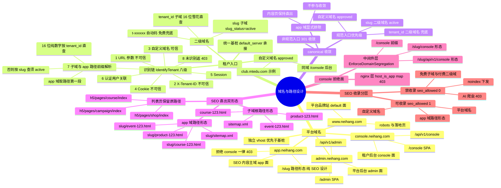

# 域名与路径设计总览（脑图）

> **文档性质**: 一图总览（Mermaid mindmap），权威细节见 `docs/tenant.md` §2.0-§2.5.2、§8.1 与 `docs/zh/deployment/nginx-guide.md`
> **最后更新**: 2026-08-23（对齐 app 域 SEO 路径形态双形态设计）

## 阅读顺序

1. **平台域名**：四个独立 vhost，`app.neihang.com` 是唯一带路径形态的（`/{slug}/...`），且是纯 SEO 面——console 双层拒绝（nginx `host_is_app` + PHP `isTenantSurface`）。
2. **租户入口**：统一基桩承接，识别链第 7 级同时覆盖「子域前缀」与「app 域路径第一段」两种形态（16 位雪花直查 / slug 须 `slug_status=active`）。
3. **SEO 双形态**：`{slug}.neihang.com/course-123.html` ⇔ `app.neihang.com/{slug}/course-123.html` 等价直出，但 app 域被 canonical 显式排除（内容页不 301，防止破坏爬虫积累）。
4. **两条横切规则**：canonical 收敛只作用于子域三形态；sitemap `contentBase()` 对 rejected slug 回退 tenant_id 防死链。

## 设计 → 实现映射

| 脑图分支 | 实现载体 |
|---|---|
| 平台域名 | `config/domain.php` `platform_domains` + `tenancy.platform_domains`；`IdentifyDomain` 五域判定 |
| 租户识别链 | `IdentifyTenant`（第 7 级 `resolveFromAppPath` / `resolveFromSlug`） |
| canonical 收敛 | `EnforceCanonicalEntry`（app 域 host 显式排除，`hash_equals` 比对） |
| console 拒绝面 | nginx `host_is_app` map + `EnforceDomainSegregation::isTenantSurface`（slug 形态正则） |
| SEO 双形态路由 | scrm `app/Modules/Seo/Routes/web.php`（`/{type}-{id}.html` + `/{slug}/{type}-{id}.html`） |
| sitemap 防死链 | scrm `SeoRenderService::contentBase()`（域感知 + slug 回退） |
| SEO 收录分层 | `NginxConfigService` 生成 `seo.map` / `bot.map`（`$seo_allowed` / `$block_ai_bot`） |
| 统一基桩 | `tenant-server.conf.stub`（map 驱动，`$domain_allowed` 白名单 444 断连） |
